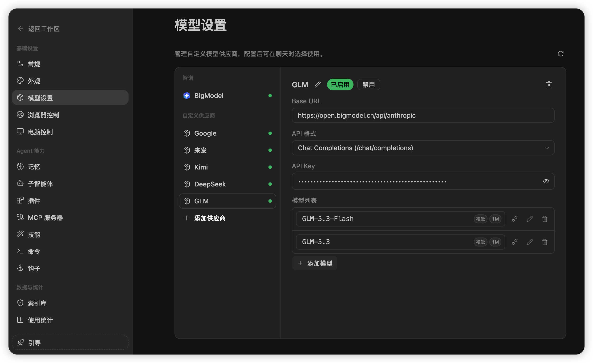
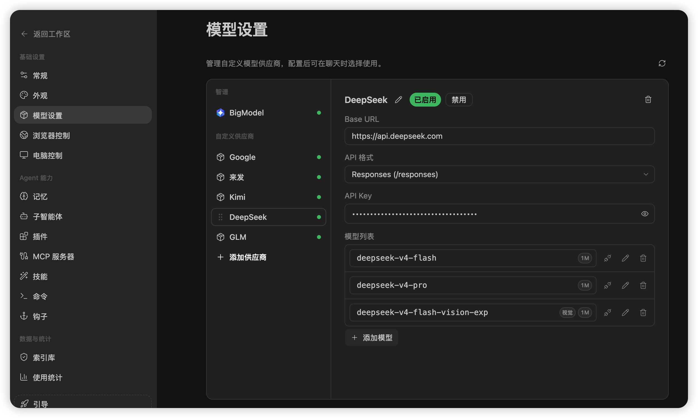
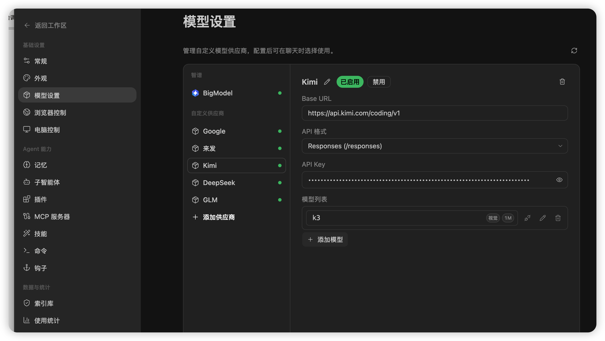
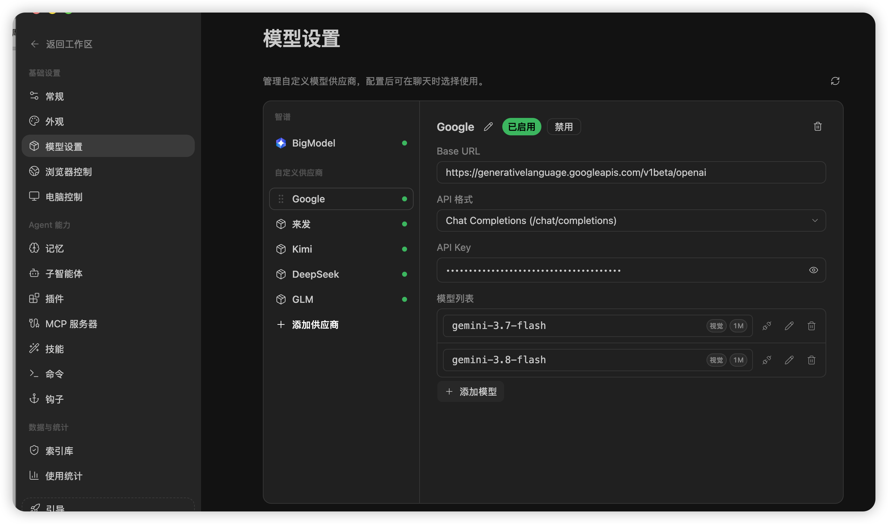

# ZCode 国产大模型配置指南

> [!IMPORTANT]
> 本指南只适用于 ZCode。开始前请先安装并启动 ZCode，在 **设置 → 模型设置 → 添加供应商** 中操作。API Key 只粘贴到 ZCode 本地设置里，禁止发到聊天、截图、Issue 或 GitHub。

本文资料核验日期：**2026-09-07**。模型名称、价格、上下文、视觉输入和工具调用能力会变化，最终以厂商控制台与官方模型列表为准。

## 先看结论：国产最小组合

建议至少配置 3 类模型，不是越多越好，而是让不同岗位各做擅长的事：

| 需要 | 国产优先选择 | 推荐岗位 |
|---|---|---|
| 中文通用与稳定主力 | 智谱 GLM | `coder`、`shencha`、`verifier`、日常任务 |
| 强推理与规划 | DeepSeek | `coder-gpt`、`coder-ds`、`seoer`、复杂分析 |
| 长文档与大上下文 | Kimi / Moonshot | `coder-kimi`、`frontend`、长需求与大仓库 |
| 多模态视觉（可选） | 通义千问 Qwen-VL 或厂商明确标注视觉的型号 | `shencha-ui`、设计稿理解 |
| 统一接入多个国产模型（可选） | 硅基流动 | 想少配置供应商、做模型对比的用户 |

> [!TIP]
> 预算有限时，从 **智谱 GLM + DeepSeek + Kimi** 开始。只有一个模型也能安装，但四个 coder 的方案对比、生产与审查隔离、视觉/长上下文岗位会明显打折。

## ZCode 里需要填写什么

添加供应商时通常需要：

1. **供应商名称**：自己容易辨认的名字，如 `DeepSeek`、`GLM`、`Kimi`。
2. **Base URL**：必须与选择的 API 格式匹配。
3. **API 格式**：ZCode 下拉框中的 Chat Completions、Responses 或 Anthropic/Messages。
4. **API Key**：从厂商官方控制台创建。
5. **模型列表**：填写当前控制台真实可用的模型 ID，大小写和符号必须完全一致。
6. **能力标签**：视觉、上下文、推理等必须按具体模型核对；不要因为厂商名或系列名自动勾选。

添加后先在普通对话中选择该模型发送一句测试消息。确认正常响应，再让安装 AI 为智能体分配模型。

> [!NOTE]
> 下方截图用于展示 ZCode 的字段位置和打码效果，不是可直接照抄的配置清单。截图可能来自不同协议或专用套餐；实际填写时，以截图上方或紧邻截图的协议/Base URL 表为准，并确保二者属于同一行。

## 推荐一：智谱 AI BigModel / GLM

适合中文通用、代码、知识处理和日常主力。视觉、OCR、长上下文能力要按具体 GLM 型号确认。

- [智谱 AI 官网](https://zhipuai.cn/)
- [开放平台](https://open.bigmodel.cn/)
- [API Key](https://open.bigmodel.cn/usercenter/apikeys)
- [模型列表](https://docs.bigmodel.cn/cn/guide/start/model-overview)
- [OpenAI 兼容文档](https://docs.bigmodel.cn/cn/guide/develop/openai/introduction)
- [Anthropic 兼容文档](https://docs.bigmodel.cn/cn/guide/develop/claude/introduction)

| API 格式 | Base URL | 官方确认 |
|---|---|---|
| OpenAI Chat Completions | `https://open.bigmodel.cn/api/paas/v4/` | 是 |
| Anthropic Messages | `https://open.bigmodel.cn/api/anthropic` | 是 |
| OpenAI Responses | 暂未从官方文档确认 | 不要猜 |



注意：截图仅展示字段位置，其中 Base URL 与 API 格式不是一组可照抄配置。智谱部分参数范围和 OpenAI 不完全相同；请按上表选择同一行的协议与 Base URL，模型名必须使用账户里实际可用的 ID。

## 推荐二：DeepSeek

适合编程、推理、SEO 规划、批量文本与成本敏感任务。

- [DeepSeek 官网](https://www.deepseek.com/)
- [开放平台](https://platform.deepseek.com/)
- [API Key](https://platform.deepseek.com/api_keys)
- [API 文档](https://api-docs.deepseek.com/)
- [模型与价格](https://api-docs.deepseek.com/quick_start/pricing)
- [Responses 文档](https://api-docs.deepseek.com/guides/responses_api)
- [Anthropic 文档](https://api-docs.deepseek.com/guides/anthropic_api)

| API 格式 | Base URL | 官方确认 |
|---|---|---|
| OpenAI Chat Completions | `https://api.deepseek.com` | 是 |
| OpenAI Responses | `https://api.deepseek.com` | 是 |
| Anthropic Messages | `https://api.deepseek.com/anthropic` | 是 |



注意：Responses 当前有功能限制，部分不支持参数可能被忽略；视觉任务只能选官方明确标注图像输入的型号。

## 推荐三：Kimi / Moonshot

适合长文档、知识工作、大仓库理解和复杂 Agent 任务。

- [月之暗面官网](https://www.moonshot.cn/)
- [Kimi 开放平台](https://platform.kimi.com/)
- [API Key](https://platform.kimi.com/console/api-keys)
- [API 总览](https://platform.kimi.com/docs/api/overview)
- [模型列表](https://platform.kimi.com/docs/models)
- [Chat Completions](https://platform.kimi.com/docs/api/chat)
- [Responses](https://platform.kimi.com/docs/api/responses)
- [Anthropic Messages](https://platform.kimi.com/docs/api/messages)

| API 格式 | Base URL | 官方确认 |
|---|---|---|
| OpenAI Chat Completions / Responses | `https://api.moonshot.cn/v1` | 是 |
| Anthropic Messages | `https://api.moonshot.cn/anthropic` | 是 |



注意：同一模型在不同协议下的图片、工具、状态保持能力可能不同，按所选协议的官方文档核对。

## 可选：阿里云百炼 / 通义千问

适合企业中文、客服、办公、Qwen-Coder、Qwen-VL 多模态等场景。

- [百炼产品页](https://www.aliyun.com/product/bailian)
- [百炼控制台](https://bailian.console.aliyun.com/?tab=home#/home)
- [API Key](https://bailian.console.aliyun.com/?tab=model#/api-key)
- [模型广场](https://bailian.console.aliyun.com/cn-beijing?tab=model#/model-market/all)
- [模型 API 参考](https://help.aliyun.com/zh/model-studio/model-api-reference/)
- [OpenAI Chat 兼容文档](https://help.aliyun.com/zh/model-studio/compatibility-of-openai-with-dashscope)
- [Anthropic / Claude Code 文档](https://help.aliyun.com/zh/model-studio/claude-code)

百炼的 Base URL 与**地域、Workspace ID、计费套餐**有关，不能给所有用户一条通用地址。请直接从对应地域官方文档复制，不要照搬其他人的 Workspace 地址。

常见 OpenAI Chat 形式：

```text
https://{WorkspaceId}.cn-beijing.maas.aliyuncs.com/compatible-mode/v1
```

常见 Anthropic 形式：

```text
https://{WorkspaceId}.cn-beijing.maas.aliyuncs.com/apps/anthropic
```

Anthropic Base URL 不要自行追加 `/v1`；Messages 客户端会请求 `{Base URL}/v1/messages`。

## 可选：硅基流动 SiliconFlow

适合用一个平台接入多个国产模型、快速比较成本和效果。

- [硅基流动官网](https://www.siliconflow.cn/)
- [控制台](https://cloud.siliconflow.cn/)
- [模型广场](https://cloud.siliconflow.cn/models)
- [API Key](https://cloud.siliconflow.cn/account/ak)
- [快速开始](https://docs.siliconflow.cn/cn/userguide/quickstart)
- [Chat Completions API](https://docs.siliconflow.cn/docs/api/chat-completions-post)
- [Messages API](https://docs.siliconflow.cn/docs/api/messages-post)

| API 格式 | Base URL | 官方确认 |
|---|---|---|
| OpenAI Chat Completions | `https://api.siliconflow.cn/v1` | 是 |
| Anthropic 风格 Messages HTTP | 暂不建议作为 ZCode Base URL 填写 | 官方提供完整端点 `https://api.siliconflow.cn/v1/messages`；未确认 ZCode 所需的完整 Anthropic SDK 兼容与 Base URL 拼接规则 |
| OpenAI Responses | 暂未从官方文档确认 | 不要猜 |

注意：平台模型会上下线，视觉、上下文、推理和工具调用必须逐个模型核验。

## 海外可选：Google Gemini

仓库以国产模型为主，但需要多语言写作或额外视觉能力时，可按账户地区和可用性选择 Gemini。



这里不提供固定模型名。请以 Google AI Studio / Cloud 控制台当前可用模型与官方兼容文档为准。

## 配置完成后的推荐分工

不必严格照抄，安装 AI 会根据实际 inventory 自动分配：

| 岗位类型 | 优先能力 | 国产推荐方向 |
|---|---|---|
| 日常编码 | 稳定、便宜、工具调用 | GLM / DeepSeek 常规模型 |
| 架构攻坚与 SEO 规划 | 强推理 | DeepSeek 推理模型、GLM 强推理型号 |
| 长上下文工程 | 长上下文 | Kimi 长上下文型号 |
| 视觉审查 | 明确支持 image input | Qwen-VL、GLM/Kimi/DeepSeek 中官方标注视觉的具体型号 |
| 内容与外贸文案 | 多语言、文风稳定 | GLM / Qwen；有需要再补 Gemini |
| 高频轻量检查 | 成本与速度 | 各厂商轻量/Flash 档 |

## 常见问题

### provider 拒绝模型

可能是模型名错误、账户无权限、余额/限流、API 格式或 Base URL 不匹配。先用该模型发送最小测试请求。仍失败时：

1. 对照厂商控制台复制真实模型 ID。
2. 核对 API 格式与 Base URL 是否属于同一协议。
3. 检查 Key、余额、地域和套餐。
4. 临时删除对应 agent 文件的 `model:` 行，让它回退到 ZCode 默认模型。

### 模型列表中没有视觉标签

不要凭模型系列名猜。只有厂商官方模型说明明确支持图像输入时才标视觉；否则视觉岗位应报告能力降级。

### 只配置一个模型可以吗

可以安装，也可以工作，但并行对比、生产/审查隔离、视觉和长上下文岗位会受限。建议至少补齐强推理、便宜快和视觉三种能力。

## 安全提醒

- 本指南中的配置截图和 README 社群二维码均为仓库版本资产，随版本 fingerprint 与校验和审计。
- API Key 只保存在 ZCode 本地设置。
- 截图前确认 Key 已完全打码。
- 不把 `~/.zcode/v2/config.json` 上传到 GitHub 或发送给 AI。
- 使用本仓库的 `scripts/model_inventory.py` 生成脱敏能力清单，AI 只读取脱敏结果。
- 发现异常消耗时立即停用 Key，在厂商控制台重建并检查调用记录。
