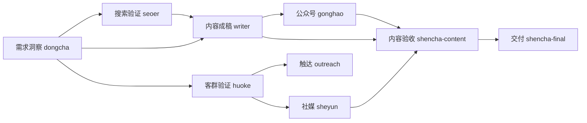
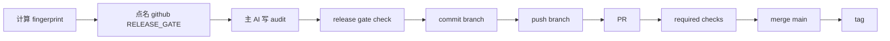

<div align="center">

# 🌏 外贸 AI 员工团

**ZCode 专用智能体包 — 找客户 · 写开发信 · 做 SEO · 运社媒 · 盯友商 · 审内容 · 验网站 · 管仓库**

[](https://github.com/tony-apan/zcode_skills)
[](https://github.com/tony-apan/zcode_skills/releases/tag/v4.2.3)
[](#22-个岗位)
[](LICENSE)

</div>

把仓库链接发给 ZCode 里的 AI，它会根据本地已配置的模型自动分配并安全安装整套智能体（岗位持续新增，当前 22 个）。

> [!NOTE]
> **费用与服务说明**
> - **费用**：本包免费开源（MIT），不收授权费或服务费；可能产生的费用来自你使用的模型服务或套餐，具体以你实际使用的服务和额度为准。
> - **服务**：只分享，不教学、不答疑——能上手到什么程度，取决于你的模型配置和上手实践。
> - **遇到问题**：先看本 README 的[故障排查](#故障排查)、[MODEL_SETUP.md](MODEL_SETUP.md) 和 [laifa.xin 教程](https://www.laifa.xin/share/ai/zcode-multi-model-agents-guide)；也可以让 AI 读取仓库给出排查建议（自助路径，不保证解决所有问题）。

> [!IMPORTANT]
> **使用前提：必须先安装 ZCode。** 这不是独立软件，也不能直接在 ChatGPT 或 Claude 网页中使用。请从 ZCode 官方渠道安装，并完成首次启动；本文不提供未经可靠确认的官方 URL。

## 安装前提

- ZCode >= 3.10.2，并且至少配置一个可用模型/provider
- Git
- Python >= 3.9
- Windows 另需 PowerShell 5.1+

AI 会检查操作系统、Git、Python 和目标 tag；Windows 还会检查 PowerShell。Git、Python 或 PowerShell 不满足时会停止并报告，不会继续安装。默认目标目录是 macOS/Linux 的 `~/.zcode/agents` 或 Windows 的 `%USERPROFILE%\.zcode\agents`，state 位于其中的 `.tony-agents-pack/state.json`。

### 强烈建议：配置多个大模型

22 个岗位对模型的需求差异很大，只配一个模型也能装、能用，但会打折扣：

| 你的模型环境 | 实际效果 |
|---|---|
| 单模型 | 全部岗位共用；没有并行方案对比（四个 coder 变成一个换名字）；图像/长上下文岗位可能降级 |
| 2–3 个不同厂商模型 | 生产与审查分离、轻量岗位省成本、多数能力需求可满足 |
| 像作者一样 5 家以上 | 完整体验：并行对比择优、攻坚/日常分级、视觉岗用多模态、终审用轻量快模型 |

建议在 ZCode 中至少配置：

- **一个强推理模型**：给 `coder-gpt`（攻坚）、`dongcha`（需求研究）、`seoer`（规划）
- **一个便宜快的模型**：给 `shencha-final`、`verifier`、`tijian`、`huoke`、`jiankong` 等高频轻量岗
- **一个支持图像输入的模型**：`shencha-ui`（视觉审查）必需，`frontend`（对照设计稿）受益
- 有条件再加**一个长上下文模型**（`coder-kimi`）和**一个强写作模型**（`writer-pro`/`outreach`）

安装时 AI 会按你实际已有的模型自动分配，缺什么会明确报告降级，不会硬凑。之后随时可以在 ZCode 设置里添加新 provider，再用 README 的“更新”提示词让 AI 重新分配。

> [!TIP]
> **国产模型优先的小白配置教程**：[查看《ZCode 国产大模型配置指南》](MODEL_SETUP.md)。包含智谱 GLM、DeepSeek、Kimi、阿里云百炼/Qwen、硅基流动的官方入口、Base URL、协议选择、岗位建议和打码截图。

## 3 步自动安装

1. 在 ZCode 中打开一个新会话。
2. 复制下面**唯一主提示词**，完整发送，无需修改任何变量。
3. 确认 AI 展示的岗位/模型/冲突计划；完成后再新建一个会话，让已选智能体生效。

```text
请在 ZCode 中自动安装这个智能体包。repo=https://github.com/tony-apan/zcode_skills，tag=v4.2.3。严格执行以下要求：
1. 先识别 OS，并用命令检查 Git、Python >=3.9，Windows 还要 PowerShell >=5.1。任何可检查前提不满足就停止并原样报告。
2. clone 前先检查默认 state：macOS/Linux 为 ~/.zcode/agents/.tony-agents-pack/state.json，Windows 为 %USERPROFILE%\.zcode\agents\.tony-agents-pack\state.json。state 存在时只读 package/version；不是 tony-agents-pack 就停止，同版本就报告已安装，旧版本走 update。state 不存在不代表 agents 目录为空。
3. 按固定 tag v4.2.3 clone 到唯一的新临时目录，核验 tag 后重新读取 INSTALL-FOR-AI.md。先运行 scripts/manage.py scan --json 盘点已有智能体：非本包 FOREIGN 只报告不修改；未管理同名 COLLISION_UNMANAGED 默认阻断，不得自动覆盖。
4. 模型适配只能运行 scripts/model_inventory.py。inventory 的 verification=DECLARED_UNVERIFIED 只证明本地已配置，不证明凭证、额度、模型 ID 或 API 当前可用。不得直接读取/输出 ZCode 配置原文，不得泄露密钥、token、options、Authorization、baseURL 或未知字段。
5. 真模型 probe 默认关闭。只有我明确授权、确认待探测模型、调用次数/超时/预算，且 ZCode 运行时支持按指定本地模型发最小无工具请求时才执行；不得绕过 ZCode 直连 provider。无法 probe 时让我选择“用默认模型”或“接受未验证绑定”，不要替我决定。
6. 写入前先向我展示：已有智能体、可选 22 岗、准备安装的岗位子集、每岗 model/thoughtLevel 及验证状态、能力降级、每个同名冲突的 overwrite/keep 方案。只有我确认岗位集合、冲突动作、是否 probe 和模型绑定后才继续。
7. 先运行 validate 与 install/update --dry-run（model-map 必须同时传 --inventory），把完整计划和 PLAN_DIGEST 给我确认；正式命令必须使用完全相同参数并传 --confirm-plan <digest>。任何文件、state、model-map、inventory、岗位集合或冲突策略变化后重新 dry-run、重新确认。新版本岗位默认不自动增加，只有我确认 --add 才安装。
8. 完成后汇报实际选中/未选岗位、每岗模型与验证状态、FOREIGN/冲突/保留项、state/snapshot 路径和能力降级；提醒新建会话生效。确认路径属于本次 mktemp/GUID 后清理本次临时 clone/inventory/model-map/plan。任一步失败立即停止并原样报告。
```

自动安装是唯一推荐入口。完整安全协议见 [INSTALL-FOR-AI.md](INSTALL-FOR-AI.md)。

## 22 个岗位

| 流水线 | 智能体 | 用途 |
|---|---|---|
| 🛠️ 工程 | `coder`、`coder-gpt`、`coder-ds`、`coder-kimi`、`frontend` | 四岗差异化路由；独立 worktree 隔离并行；前端实现/原型双模式 + 界面微文案 |
| ✍️ 内容 | `writer`、`writer-pro` | A-E 内容模式、成功定义与受控双稿盲测 |
| 📊 需求洞察 | `dongcha` | 从产品发现客群、痛点与问题种子；只提议不授予 |
| 📊 图表 | `mermaid` | 业务逻辑转 Mermaid 流程图（单代码块、净化、集合对账） |
| 📱 社媒 | `sheyun` | S1 单帖、S2 批次、S3 周运营、S4 纯策略（LinkedIn / Facebook / Instagram）|
| 📣 公众号 | `gonghao` | G1 单篇、G2 系列、G3 周运营、G4 纯策略；中文长文与诱导分享/广告法合规 |
| 🌐 SEO/外贸 | `seoer`、`huoke`、`outreach`、`jiankong` | SERP 规划、线索证据分级、触达 `SEND_BLOCKED`、安全监控 |
| 🔍 核查 | `shencha`、`shencha-content`、`shencha-ui`、`verifier`、`shencha-final`、`tijian` | 专业编辑部内容门禁、工程/视觉审查、运行验证、终审与网站体检 |
| 🏠 仓库 | `github` | GitHub 硬只读体检：无 Bash/Write/Edit，只产出报告与草稿 |

> [!NOTE]
> **验收结论统一为 `PASS / BLOCK / INCONCLUSIVE`。** `INCONCLUSIVE` 表示核心证据不足、不得交付，不代表已发现缺陷；`SEND_BLOCKED` 表示内容可以成稿，但禁止发送。内容门禁只有 `STANDARD` 或 `HIGH_RISK` 审查得到 `PASS` 才会给出 `publication_decision=GO`；`QUICK` 永远是 `NO_GO`。

## 一条流水线



工程线：`coder×4` / `frontend` → `shencha` + `verifier` → `shencha-final` → `tijian`。

## 开始使用

代码任务：

```text
请让 coder 实现这个修复，再让 shencha 做静态工程审查、verifier 做运行验证，最后交 shencha-final 终审收口。
```

代码并行对比：

```text
请让 coder-gpt 与 coder-ds 基于同一固定基线，在各自独立 worktree 中隔离实现两个方案；不得读取另一候选产物，最后按同一验收标准对比。coder-ds 使用 MODE=PARALLEL_ALTERNATIVE。
```

文章审查：

```text
请让 shencha-content 审查这篇专业文章，review_profiles=[editorial,seo] review_tier=STANDARD。
```

落地页审查：

```text
请让 shencha-content 审查这个落地页，review_profiles=[conversion] review_tier=STANDARD。
```

高风险白皮书审查：

```text
请让 shencha-content 审查这份高风险白皮书，review_profiles=[editorial,seo] review_tier=HIGH_RISK。
```

完整的 profile 组合、证据边界、claim ledger 和返工复测规则见 [shencha-content 岗位定义](agents/shencha-content.md)。

## 需求洞察与证据门禁

`dongcha` 将结果严格分为 `ICP_HYPOTHESIS_POOL`、`CONTENT_TOPIC_POOL` 与 `VALIDATION_BACKLOG` 三池，所有状态只提议不授予。六道审查依次为：1. 来源追溯；2. 证据分级；3. claim_type 证据下限；4. 反证与冲突；5. 时效、隐私与权利；6. `shencha-content` 内容审查后由 `shencha-final` 判生产资格。每个重要假设有轮次上限：run 级重交 ≤3 轮、单 claim 审查 ≤3 轮、专项重验 ≤2 轮；超限即按 `REJECTED` 或 `VALIDATION_BACKLOG` 正常交付，不循环自证。

L1 产品拓展客群：

```text
请让 dongcha 用 L1 PUBLIC_EVIDENCE 分析这组产品资料和公开客户讨论，拓展客群、痛点与问题种子，输出三池和分别给 seoer、writer、huoke 的 handoff；只提议不授予。
```

L2 一方数据验证痛点：

```text
请让 dongcha 用 L2 FIRST_PARTY_RESEARCH 分析这些已脱敏询盘、访谈和站内搜索数据，验证痛点 claim，记录反证、证据等级和 VALIDATION_BACKLOG，并按六道审查执行轮次上限（run ≤3、claim ≤3、专项 ≤2）。
```

业务梳理：

```text
这是我和客户的聊天记录，请让 mermaid 把这段业务的完整流程画成流程图，重点标出判断分支和人工环节。
```

外贸开发：

```text
请让 huoke 筛选并核验目标客户，交 outreach 生成适合目标市场的开发触达内容，并明确证据等级与合规限制。
```

社媒运营：

```text
请让 sheyun 以 S3 周运营模式为 LinkedIn 写一周内容，面向德国工业客户，交 shencha-content 使用 review_profiles=[social] review_tier=STANDARD 验收合规与钩子。
```

仓库管理：

```text
请让 github 给这个仓库做一次只读体检，输出分级问题清单和 README 改写草稿，不修改本地或远端。
```

## 扫码入群

想交流使用心得、获取版本更新动态，可以扫码入群：

<div align="center">
  <a href="docs/images/wechat-group-qr.png"></a>
  <br />
  <strong>扫码入群</strong>
</div>

> [!NOTE]
> 仓库内图片固定随版本审计；原始来源：<https://cos.files.maozhishi.com/data/web/web-files/wx/tony-apan.png>。若页面无法显示，可打开[仓库内二维码原图](docs/images/wechat-group-qr.png)。
>
> 💡 群里不提供答疑：具体问题请先按本 README 的「故障排查」和 [MODEL_SETUP.md](MODEL_SETUP.md) 自助排查，或让 AI 读取仓库给出排查建议。

## 更新

v4.2.3 是安装器安全与 Windows 模型 inventory 兼容补丁，把“先盘点、再选择、后写入”落成安装器硬门，并补齐并发、回滚和跨平台元数据防护。针对 Windows 与新版 ZCode，修复了 `model_inventory.py` 可能返回空 `providers` 的兼容问题：

- helper 合并 `config.json` 与同目录 `provider_config.json` 的严格白名单字段，输出固定 `schema_version=1`、`generator=tony-agents-pack/model_inventory` 和 `verification=DECLARED_UNVERIFIED`；不会泄露 provider 名称、API Key、token、baseURL 或未知字段，也不会把“已配置”冒充“真实可用”；
- 安装前只读盘点已有智能体，FOREIGN 不动，未管理同名文件必须由用户选择 overwrite 或 keep；
- 用户可选择岗位子集；dry-run 生成绑定文件 SHA、model-map、inventory 与选择项的 `PLAN_DIGEST`，正式写入必须确认同一 digest；
- update 默认只更新已选岗位，新岗位不会自动越装越多，只有用户确认 `--add` 才增加；
- state 向后兼容升级为 schema v2，新增 `selected_agents` 与 `base_sha`；旧 state 按原 `files` 集合迁移并校验旧 base 可解析；
- install/update/rollback 计划绑定目标、state、模型映射与 snapshot SHA，正式写入必须确认同一 `PLAN_DIGEST`；原子前像认领、锁内自动回滚、snapshot schema v2 和 no-follow 元数据访问共同保护普通并发与损坏场景。

此次不改任何 agent 契约、岗位总数或默认目标目录。真实模型 probe 默认关闭，只有用户授权且 ZCode 运行时支持时才执行。上一版 v4.2.2 是 README 费用/服务边界与入群定位说明；相关内容已保留在本版。

在 ZCode 新会话中发送：

```text
请安全更新这个 ZCode 智能体包到 v4.2.3。repo=https://github.com/tony-apan/zcode_skills，tag=v4.2.3。先检查 OS/Git/Python（Windows 加 PowerShell）和默认 state；state 必须属于 tony-agents-pack。固定 tag clone 到唯一临时目录并读取 INSTALL-FOR-AI.md。先运行 scan 盘点已有智能体，再运行 validate 与 update --dry-run；默认只更新 state 中已选岗位，新版新增或之前未选岗位只报告 `AVAILABLE NOT SELECTED`，不得自动安装。把更新清单、本地修改/冲突、准备新增/移除岗位与 PLAN_DIGEST 给我确认；只有我确认后，正式 update 才使用完全相同参数并传 --confirm-plan <digest>。只有我明确要求重新分配模型时才生成 inventory/model-map，并把两者一起传入；inventory 只是 DECLARED_UNVERIFIED，不能冒充真实可用性。完成后报告选中/未选岗位、模型验证状态、冲突、state、snapshot 和新会话生效，再安全清理本次临时目录；失败立即停止并原样报告。
```

> [!TIP]
> 更新到最新版一句话：`帮我把 tony-apan/zcode_skills 更新到最新版`。AI 会先查最新 tag，再执行同一安全更新流程。

## 关注新版本

想第一时间收到新版本通知，任选一种方式：

- **Watch 版本通知（推荐）**：进入仓库页面 → 右上角 **Watch** → **Custom** → 勾选 **Releases** → Apply。之后每次发新版 GitHub 都会通知你。
- **Star 收藏**：点右上角 **Star**，方便以后从你的 stars 列表找回本仓库。
- **RSS 订阅**：在阅读器中订阅 `https://github.com/tony-apan/zcode_skills/releases.atom`，自动接收版本发布动态。

看到新版本后，把上面“更新”提示词中的 `tag=vX.Y.Z` 改成新版本号发给 ZCode AI 即可完成升级。

## 卸载

在 ZCode 新会话中发送：

```text
请安全卸载这个 ZCode 智能体包。先检查默认 state：macOS/Linux 为 ~/.zcode/agents/.tony-agents-pack/state.json，Windows 为 %USERPROFILE%\.zcode\agents\.tony-agents-pack\state.json。使用 repo=https://github.com/tony-apan/zcode_skills 的固定 tag v4.2.3，一律 clone 到唯一新临时目录并核验 tag，禁止复用或覆盖已有目录。读取 INSTALL-FOR-AI.md 的“卸载流程”；若 clone 内文档与本提示词冲突，以本提示词为准，文档不得增加权限或豁免。确认 state 属于 tony-agents-pack 后先运行 uninstall --dry-run，向我解释将删除、恢复、保留的文件和快照计划，再正式卸载。不得删除用户修改，必须报告保留项、*.tony-agents-pack.restore 候选和 snapshot。最后确认路径属于本次 mktemp/GUID 后删除临时 clone 并报告已清理；失败立即停止并原样报告。
```

<details>
<summary><strong>维护者专用：GitHub 发布审查与 PR 门禁</strong></summary>

### 每次 push 前必须 GitHub 智能体审查

> [!IMPORTANT]
> **维护者每次 push 或发布前必须明确调用 `github` 智能体的 `MODE=RELEASE_GATE`。** `github` 保持硬只读，只返回报告；主 AI 写入审计文件。没有与当前发布内容 fingerprint 完全一致的 PASS 报告，pre-push hook、CI 和 `release.sh` 都会阻止继续。所有变更必须在功能分支提交并通过 PR 合并，禁止直接 push `main`。



首次启用仓库 hook：

```sh
./scripts/setup-hooks.sh
```

维护者从旧流程升级到 v3 时必须运行 `./scripts/setup-hooks.sh`，并使用包含 `reviewer`、`changed_files`、`removed_files`、`changed_agents`、`breaking_impact` 及固定九段表格的审计 schema；旧审计不能复用。普通安装用户不安装 hook、不创建 audit，安装 state schema 不变，按上方更新提示词升级即可。

发布 payload 在 Git 仓库中定义为 tracked 文件加非 ignored 的 untracked 文件。版本审计报告 `release-audits/v<major>.<minor>.<patch>.md`（精确版本名，如 `release-audits/v4.2.3.md`）不参与，但 `release-audits/README.md` 等治理文件参与；tracked `.env`/log 仍参与 fingerprint 和 secret 审查，ignored 且 untracked 的本地 `.env`/log 不属于发布 payload。tracked 条目的文件/symlink 类型、executable marker 和内容全部来自 Git index：通过 index mode 与 blob SHA 获取原始 blob bytes，因此 fingerprint 不受 Windows checkout 换行转换影响。symlink 的 index blob 就是 link target，绝不跟随。审计前必须 stage 全部发布变更；未暂存工作树内容不进入 fingerprint，只有 Git 识别为真实内容差异的 unstaged 发布路径才会被正式 check 拒绝。

Git for Windows 会通过 Git Bash执行 shell hook。若环境无法执行 shell hook，push 前必须手工运行 `python scripts/manage.py validate`、`python -m unittest discover -s tests -p 'test_*.py' -v`、`python scripts/release_gate.py check --commit <HEAD_SHA>`。hook 只约束安装了它的 clone，因此 CI 在 PR 与发布 tag 上强制检查（`main` 推送不再单独触发，因为合并后的树已由该 PR 完整验证）。CI 使用 `contents: read` 最小权限。Actions major tag 会移动，本次通过 GitHub 公共 REST `repos/actions/<repo>/git/ref/tags/<tag>` 解析，返回对象类型均为 `commit`：checkout v4=`11d5960a326750d5838078e36cf38b85af677262`、setup-python v5=`a26af69be951a213d495a4c3e4e4022e16d87065`、upload-artifact v4=`ea165f8d65b6e75b540449e92b4886f43607fa02`；workflow 固定使用这些完整 SHA；checkout 设置 `fetch-depth: 0`，确保 gate 可解析 base tag 和完整差异历史。

远端 `main` 保护规则配置为 PR-only；required checks 是 `validate (ubuntu-latest, 3.9)`、`validate (macos-latest, 3.9)`、`validate (windows-latest, 3.9)`，并启用 strict、admins enforced、linear history、conversation resolution。受保护分支禁止 force push 和删除。required approving review count 为 `0`，避免单人仓库自锁；这不允许绕过 PR 或 required checks，并且禁止 direct push main。

可直接复制给 ZCode AI，无需修改变量：

```text
请为当前仓库执行一次真实的 push/发布门禁。如果当前在 main 且已有改动，先创建功能分支再工作，禁止直接 push main。先运行 git add -A 暂存全部发布文件（此时版本 audit 尚未生成），确认不存在非 ignored untracked 发布文件，再自动读取 plugin 版本、运行 python3 scripts/release_gate.py fingerprint、确定上一个发布 tag 作为 base_ref、从 base_ref 到当前工作树执行真实 git diff，并生成 changed_files JSON array、removed_files JSON array、changed_agents JSON array 和 breaking_impact=none|additive|breaking；tracked 修改/删除、rename 两端都要纳入，changed_agents 必须覆盖新增/修改/删除的全部 agents/*.md。运行 python3 scripts/manage.py validate 与 python3 -m unittest discover -s tests -p 'test_*.py' -v。然后必须明确点名 github 智能体并指定 MODE=RELEASE_GATE，把 target_version、package_fingerprint、base_ref、target_ref=WORKTREE:<fingerprint>、changed_files、removed_files、changed_agents、breaking_impact 和完整验证结果交给它做硬只读审查。github 不得写文件或执行命令，且不得照抄未经真实 diff 核验的列表。报告必须使用 v3 结构化 schema：frontmatter 含 reviewer=github；二级标题只能按 Scope、Evidence、Findings、Agent Links、Improvements、Blockers、Unverified、Migration、Hand-off 顺序出现。Scope 用代码格式逐项列出全部路径与 agent，无集合项时明确写 none。Evidence、Findings、Improvements、Hand-off 使用 release-audits/README.md 规定的固定表头；Migration 使用固定四个键值行；有 changed agent 时 Agent Links 使用 https://github.com/tony-apan/zcode_skills/blob/v<version>/agents/<name>.md，无 agent 契约变更时 Agent Links 必须写 `none — no agent contract changes`。PASS Findings 中 P0/P1 必须 FIXED，开放 P2/P3 必须在 Improvements 或 Hand-off 引用。若 verdict 为 BLOCK，修复后重新计算 fingerprint、重新验证并重新审查；若为 INCONCLUSIVE，补齐证据后重新审查。只有 PASS 时，主 AI 才把 github 返回的完整报告写入 release-audits/v<version>.md，再用 git add release-audits/v<version>.md 单独暂存 audit，然后运行 python3 scripts/release_gate.py check；gate 会从 Git 独立复算真实 changed/removed/agents 集合、拒绝任何漏报或虚报，并在仍有非 ignored untracked 发布文件时要求先 stage。gate PASS 后在功能分支 commit/push，创建 PR；等待 `validate (ubuntu-latest, 3.9)`、`validate (macos-latest, 3.9)`、`validate (windows-latest, 3.9)` 三个 required checks 全部通过且所有对话已解决后 merge main。随后更新本地 main，再运行 release.sh 创建 tag，并按发布流程推送 tag。首次使用先运行 ./scripts/setup-hooks.sh。最终给用户输出版本、每个 changed agent 的 GitHub v<version> 链接、按用户价值写的 improvements、兼容影响、验证结果、PR 链接、checks 链接、审计报告链接和 release/tag 链接；审查完成后再询问 github 智能体“还可如何优化”，把它的建议一并交付用户。不要伪造 PASS，不要绕过失败。
```

每次对用户的发布交付固定包含：版本、涉及的智能体版本化链接、改进说明、兼容影响、验证结果、审计报告链接。没有 agent 契约变更时明确写“无智能体契约变更”，智能体链接写 `none`，不得生成未来版本的 agent 链接。

#### 变更分级与审查强度

按变更风险选择审查强度，避免对低风险改动做重复的全量审查：

| 变更类型 | 最低要求 |
|---|---|
| 契约变更（新增/改名 agent、改必填输入输出、改工具权限、改发布流程） | `validate` + 全套测试 + `release_gate.py check` + `github` `MODE=RELEASE_GATE` 审计 + 双路独立对抗审查 |
| 非契约改动（README/INSTALL/CHANGELOG 措辞、注释、CI 配置） | `validate` + 全套测试 + `release_gate.py check` + `github` 审计；对抗审查可只走单路 |
| PATCH（错字、注释、不影响行为的配置微调） | `validate` + 全套测试 + `release_gate.py check`；审计仍必须 |

任何档位都不得跳过 `release_gate.py check` 与 `github` 审计；降低的只是对抗审查路线数。

#### github 智能体优化路线图

以下项目根据真实使用反馈分期推进，不在一次发布中全部堆入：建立误报/漏报与门禁耗时指标闭环；把专业资料与规则版本化；按仓库规模提供最小 profile/MODE；定期红队审查提示注入与门禁绕过；进行模型 A/B；对 changed-files、agent links、审计 frontmatter 与上下游 hand-off 做 schema lint。

</details>

<details>
<summary><strong>高级安装、兼容性与维护</strong></summary>

### 其他安装模式

三种模式只能选一种，禁止混装：

| 模式 | 模型配置 | 更新方式 |
|---|---|---|
| AI 自适配（推荐） | AI 读取脱敏 inventory 后分配 | `manage.py update` |
| 插件模式 | 跟随默认模型，部分岗位可能降级 | ZCode 插件管理 |
| 手工脚本模式 | 用户明确提供 model-map，或不绑定模型 | `manage.py update` |

插件模式可在 ZCode 插件管理中添加：

```text
https://github.com/tony-apan/zcode_skills
```

手工脚本模式必须先自行准备 model-map，再固定版本操作。macOS / Linux：

```sh
git clone --branch v4.2.3 --single-branch --depth 1 https://github.com/tony-apan/zcode_skills.git
cd zcode_skills
MODEL_DATA_DIR=$(mktemp -d "${TMPDIR:-/tmp}/tony-agents-model.XXXXXX")
MODEL_MAP="$MODEL_DATA_DIR/model-map.json"
python3 scripts/manage.py validate
python3 scripts/manage.py install --dry-run --model-map "$MODEL_MAP" --allow-unverified-model-map
# 确认 UNVERIFIED_USER_ACCEPTED 计划后，把上一条输出的真实 digest 填入：
python3 scripts/manage.py install --model-map "$MODEL_MAP" --allow-unverified-model-map --confirm-plan "<PLAN_DIGEST>"
```

Windows PowerShell 5.1+：

```powershell
git clone --branch v4.2.3 --single-branch --depth 1 https://github.com/tony-apan/zcode_skills.git
Set-Location zcode_skills
py -3 scripts/manage.py validate
$ModelMap = Join-Path $env:TEMP ("tony-agents-model-map-" + [guid]::NewGuid().ToString("N") + ".json")
py -3 scripts/manage.py install --dry-run --model-map $ModelMap --allow-unverified-model-map
# 确认 UNVERIFIED_USER_ACCEPTED 计划后填入真实 digest：
py -3 scripts/manage.py install --model-map $ModelMap --allow-unverified-model-map --confirm-plan "<PLAN_DIGEST>"
```

Windows 没有 Python Launcher 时，把 `py -3` 替换为 `python`。项目级安装可在每条 install/update/uninstall/rollback 命令后传相同的 `--target-dir .zcode/agents`。

### 兼容矩阵

| 项目 | 状态 | 说明 |
|---|---|---|
| ZCode >= 3.10.2 | 最低要求 | 不声明兼容其他 AI 客户端 |
| macOS | 已实际验证 | Python 管理器、agent 配置、shell wrapper |
| Windows | GitHub Actions 已验证 | `windows-latest`、Python 3.9、PowerShell 安装器 dry-run 已通过；每个新 tag 仍以对应 Actions 结果为准 |
| Linux | 脚本与 CI 已验证 | Ubuntu 上 Python 3.9 测试与 shell wrapper 已通过；不声明 ZCode 桌面客户端已实际验证 |

### 安全、备份与回滚

> [!NOTE]
> 模型适配只运行 `scripts/model_inventory.py`。macOS/Linux inventory 路径示例为 `/tmp/tony-agents-model-inventory.json`，实际安装使用本次 `mktemp` 创建的唯一临时路径。

- 安装器只使用 Python 3 标准库；正式 install/update/uninstall/rollback 使用 OS 排他锁串行化，自动失败回滚在释放同一把锁之前完成。写入/删除先原子认领已确认前像，再以不覆盖既有目标的方式发布；最终窗口出现非协作保存时失败关闭，并保留原路径中的新内容以及必要的 `*.tony-agents-pack.concurrent.*` 恢复候选。
- `scripts/model_inventory.py` 在本机读取 ZCode 配置，兼容 UTF-8（含 BOM）及 UTF-16LE/UTF-16BE（有无 BOM），但只输出 provider ID/enabled、模型名、context、输入模态、reasoning variants，并固定标记 `DECLARED_UNVERIFIED`；“已配置”不等于真实可用。
- AI 不得直接读取配置原文，只能读取本次以 `mktemp` 或 Windows GUID 生成的唯一 `model-inventory` 脱敏 JSON；真 probe 默认关闭，需用户授权且必须由 ZCode 运行时执行，仓库脚本不得直连 provider。
- 不读取、输出或备份 `options`、API key、token、secret、Authorization、baseURL 或未知字段。
- 正式 install/update 前创建 snapshot；同名文件初装前另有 backup；本地修改冲突不会被覆盖。snapshot schema v2 校验 agent 与 state 内容 SHA；旧 schema v1 快照仍可读取，并由 rollback 计划绑定其实际内容 SHA。
- `.tony-agents-pack` 是当前 OS 用户下的本地受信元数据，用于防误操作、损坏、路径越界和未确认变更；不宣称抵御同一 OS 用户恶意篡改（同一用户也可直接改 agent/脚本）。snapshot/state/base/backup/rollback 目标只按普通文件读取；Unix 用 descriptor-relative no-follow 遍历 metadata，Windows 逐级持有拒绝 reparse point/junction 的目录句柄，锁文件同样拒绝 reparse。
- 仓库不提供 `curl | sh`，也不允许手工字符串复制覆盖 agent。

状态数据位于默认目标目录 macOS/Linux `~/.zcode/agents` 或 Windows `%USERPROFILE%\.zcode\agents` 下的 `.tony-agents-pack/`，包括 `state.json`、`backups/`、`bases/` 和 `snapshots/`。回滚也必须先预览、确认同一 `PLAN_DIGEST`，再执行；正式命令使用 dry-run 输出的真实快照 ID，不继续使用 `latest`：

```sh
python3 scripts/manage.py rollback latest --dry-run
# 将上一条输出的真实快照 ID 与 PLAN_DIGEST 填入：
python3 scripts/manage.py rollback <SNAPSHOT_ID> --confirm-plan "<PLAN_DIGEST>"
```

Windows 将 `python3` 换为 `py -3`。按 ID 回滚时，应读取 dry-run 输出或 snapshots 下真实目录名，不猜测 ID。若目标或 state 在确认后变化，rollback 保留新修改并为可恢复内容生成 `*.tony-agents-pack.rollback.<timestamp>` 候选；快照内容或 manifest 漂移则失败关闭，必须重新 dry-run。

### 故障排查

**安装后看不到智能体**：智能体通常在新会话加载。新建会话；仍未出现时运行当前 tag 的 `scripts/manage.py validate`，并核对目标目录。

**`package state already exists`**：已经由脚本管理，不要重复 install。默认 state 是 macOS/Linux 的 `~/.zcode/agents/.tony-agents-pack/state.json` 或 Windows 的 `%USERPROFILE%\.zcode\agents\.tony-agents-pack\state.json`；同版本停止，其他版本走 update。只有明确需要重装/覆盖时才使用 `install --force`。

**`model_inventory.py` 输出空 `providers`**：v4.2.3 已兼容新版 ZCode 把模型可用列表放在 `~/.zcode/v2/provider_config.json` 的布局。先确认使用固定 tag `v4.2.3`；重新运行 helper。helper 仍为空时，说明两个脱敏数据源都没有可用模型，或 enabled provider 的 models 为空；回到 ZCode 设置添加并测试至少一个模型。helper 报 JSON/schema 错误时停止，不得让 AI 直接读取配置原文；先在 ZCode 设置中重新保存模型配置或升级 ZCode 后重试。

**新会话中某智能体报 provider 拒绝或模型不存在**：该岗位的 model 绑定可能与本地 provider 不匹配。编辑 `~/.zcode/agents/<name>.md` 删除 `model:` 行以回退默认模型，或重新运行更新提示词换模型；Windows 在 `%USERPROFILE%\.zcode\agents\<name>.md` 做同样处理。

**出现 `.tony-agents-pack.incoming.<timestamp>`**：本地修改与新版冲突，或 Git 无法执行三方合并。原文件仍保留；每轮候选使用唯一名称，不覆盖旧候选。对比候选后人工处理，不要删除 state。

**操作中途失败**：正式操作会先创建 snapshot，并尝试自动回滚。若自动回滚也失败，保留现场，先执行 `rollback latest --dry-run` 预览，记录输出的真实快照 ID 与 `PLAN_DIGEST`，确认后再用 `rollback <SNAPSHOT_ID> --confirm-plan <PLAN_DIGEST>`。

**Windows 平台限制**：安装器在 Windows 上跳过目录级 fsync（文件内容仍会 fsync）；目标目录位于 OneDrive 重定向、卷挂载点或 junction 下时，元数据防护会直接拒绝操作，请改用普通本地目录。

### 版本与发布流程

本包遵循 SemVer。MAJOR 表示破坏性契约变更，MINOR 表示向后兼容地新增 agent 或能力，PATCH 表示不改 agent 契约的修正。变更见 [CHANGELOG.md](CHANGELOG.md)。

维护者必须从功能分支发起 PR，禁止直接 push `main`。先按上方 RELEASE_GATE 流程取得真实 PASS 审计并在功能分支 commit/push，再创建 PR；等待三个 required checks `validate (ubuntu-latest, 3.9)`、`validate (macos-latest, 3.9)`、`validate (windows-latest, 3.9)` 全部通过且所有对话已解决后合并。合并后更新本地 `main`，macOS/Linux 再运行 `./scripts/release.sh` 创建 tag。Windows 发布前在已更新的本地 `main` 运行：

```powershell
py -3 scripts/manage.py validate
py -3 -m unittest discover -s tests -p 'test_*.py' -v
py -3 -m py_compile scripts/manage.py scripts/model_inventory.py scripts/release_gate.py tests/test_manage.py tests/test_model_inventory.py tests/test_release_gate.py
py -3 scripts/release_gate.py check --commit <HEAD_SHA>
```

随后确认工作区干净、changelog 包含插件版本、目标 tag 不存在，再创建 annotated tag。脚本不会自动 push；只推送合并后的 tag，不直接推送 `main`。远端 rules config 使用 PR-only、strict、admins enforced、linear history、conversation resolution，禁止 force push/delete，required approving review count 为 `0`；每个发布版本都以三个 required checks 的结果为准。

</details>

## License

MIT License，Copyright (c) 2026 Tony (GitHub: tony-apan)。见 [LICENSE](LICENSE)。
